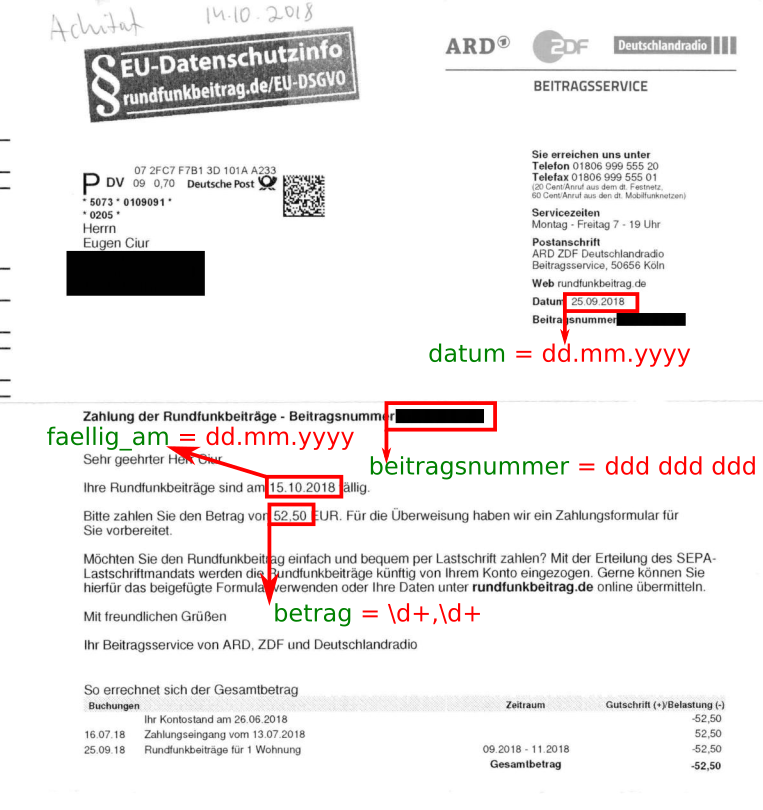

ARD ZDF Deutschlandradio - Zahlung der Rundfunkbeiträge
=======================================================

[Papermerge DMS](https://github.com/ciur/papermerge) metadata extractor plugin for ARD ZDF Rundfunkbeiträge service.

This plugin returns 5 metadata labels/keys named as follows:

* **context** - always set to 'ARD ZDF Deutschlandradio'
* **betrag** - amount need to be paid
* **beitragsnummer** - contract number
* **faellig_am** - pay until date
* **datum** - date when snail letter was sent

Where:

* **betrag** is of type money (as per main app metadata types) with format \d+,\d+
* **betragsnummer** is an ID (string) composed of 9 digits
* both **faellig_am** and **datum** are of type date. Format dd.mm.yyyy

## Installation

    pip install papermerge-meta-plugin-ard-zdf-deutschlandradio

Notice that for configuration you will use plugin name WITHOUT prefix (i.e.
without papermerge-meta-plugin- part).
Also, for importing this module you need to use name WITHOUT prefix:

    import deutschlandradio

Usually you don't need to import plugin directly, main app does it for you.

In papermerge.conf add "deutschlandradio.Deutschlandradio" entry to METADATA_PLUGINS:

    METADATA_PLUGINS = [
        "deutschlandradio.Deutschlandradio", ...
    ]

## Prepare Development Environment & Run Tests
    
1. virtualenv .venv -p /usr/bin/python3.8  # provide virtualenv path to 3.8 interpreter
2. source .venv/bin/activate  # activate .venv virtual environment
3. pip install -r requirements.txt # install dependencies
4. python setup.py develop  # provide a link to dev version of hocron
5. python test/run.py

